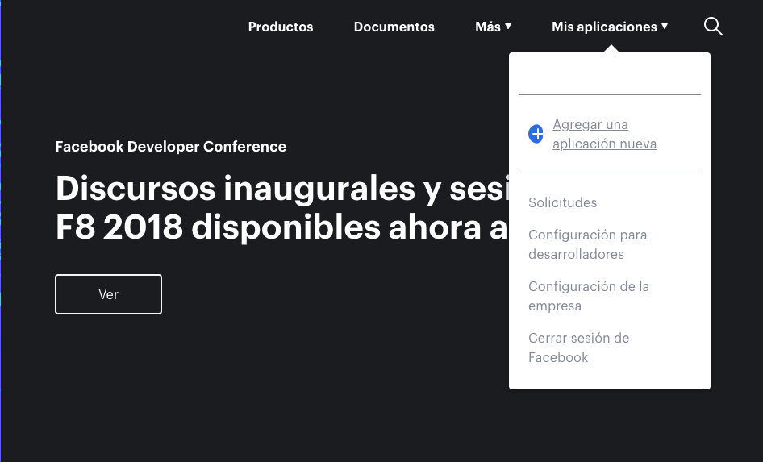
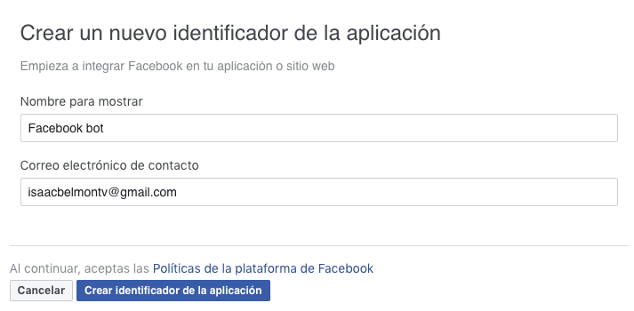
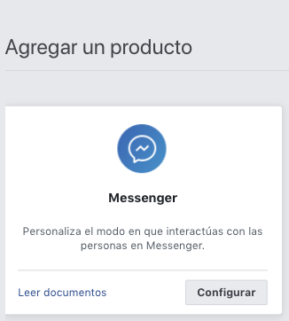
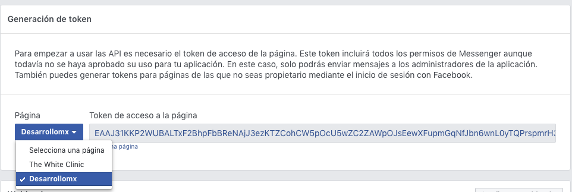
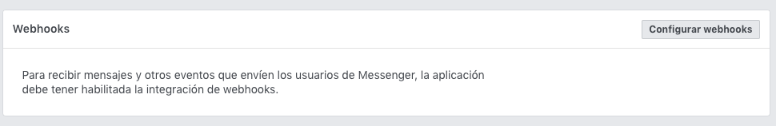
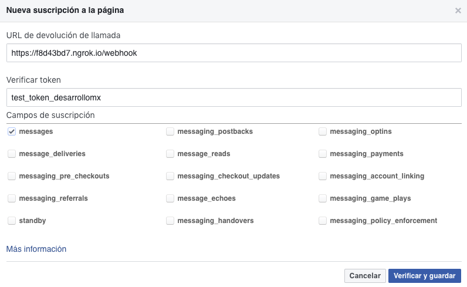
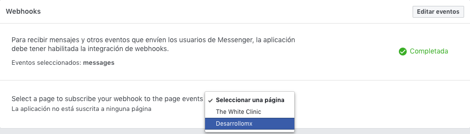

<p align="center"></p>

## Project name: BOT facebook :bomb:

### Instalación y Requerimientos
* Compatibilidad con HTTPS
* Un certificado SSL válido
* Un puerto abierto que acepte solicitudes GET y POST

* Instalacion de Node.js
```
npm init   
```

* Instalacion de Express
```
npm install express body-parser --save  
```

* Instalacion de Ngrok (manera local)
[link descarga](https://ngrok.com/download/)
  * Descargar y ejecutar


### Ejecucion del bot de manera local
  * Comandos desde la terminal dentro del proyecto

    * el https link que genera, es el que utilizamos de url del webhook y no puede pararse ese comando o generara otro link *(3000 es el puerto asignada en index.js).*
    ```
    ngrok http 3000
    ```

    * Ejecutar el archivo de node desde la terminal dentro del proyecto, este archivo es el que se editara y para que los cambios puedan guardarse se debe reinicar este comando.

      ```
      node index.js
      ```

### Pasos
* Crear pagina en [facebook](facebook.com)
* Crear cuenta en [devfacebook](developers.facebook.com) ó iniciar sesion con la cuenta que tiene permiso de administrador de la pagina.

### Facebook developers console
1. Seleccionar la opción Agregar una aplicación nueva


1. Ingresar el nombre del proyecto y seleccionar Crear identificador de la aplicación.


1. Seleccionar configuración en Messenger


1. Ir a la seccion Generación de token y seleccionar el sitio donde implementaremos el bot, copiar el token y utilizarlo en const APP_TOKEN dentro de index.js


### Configuración de el webhook

1. Ir a la seccion Webhooks y seleccionar el botón configurar webhooks


1. Agregar la url de direccion la cual es el link del servidor /webhook en este caso utilizamos el link que generamos de manera local.

1. el token que utilizaremos es test_token_desarrollomx este se encuentra en la configuración del webhook dentro del archivo index.js

1. Seleccionamos la opción de messages y Verificamos y guardamos nuestros cambios.

  

1. Por ultimo seleccionamos la pagina donde se implementara el webhook.

    
### Configuración dentro de index.js

implementacion de token en index.js *EJEMPLO*

```
const APP_TOKEN ='EAAJ31KKP2WUBALTxF2BhpFbBReNAjJ3ezKTZCohCW5pOcU5wZC2ZAWpOJsEewXFupmGqNfJbn6wnL0yTQPrspmrH3UjCZBy3DqcjlZAyZBGIPLLZALoFdwZAswnzXmd958ahCLyURLoa5tbunzbyPf8NqtGBKUovOOWZAh0VzjZAr6QQZDZD'
```

weebhook configuración el test_token_desarrollomx es el token que envia facebook para identificar nuestro servidor
```
app.get('/webhook', function(req, res){
  if(req.query['hub.verify_token'] === 'test_token_desarrollomx'){
    res.send(req.query['hub.challenge']);
  }else{
    res.send('tu no tienes acceso');
  }
});
```


:camel: [link documentación MarkDown!](https://guides.github.com/features/mastering-markdown/) :camel:


 <p align="center">
   
 </p>


 https://github.com/Raniazy/messenger-bot-tutorial

 https://developers.facebook.com/docs/messenger-platform/useful-resources

 https://developers.facebook.com/docs/messenger-platform/app-review

 https://github.com/Schmavery/facebook-chat-api


Web view
https://blog.messengerdevelopers.com/using-the-webview-to-create-richer-bot-to-user-interactions-ed8a789523c6
https://github.com/fbsamples/messenger-platform-samples/tree/master/webview

https://stackoverflow.com/questions/42627440/how-to-get-name-timezone-gender-of-your-bot-user-in-messenger-1-4-api


https://developers.facebook.com/docs/messenger-platform/app-review/
